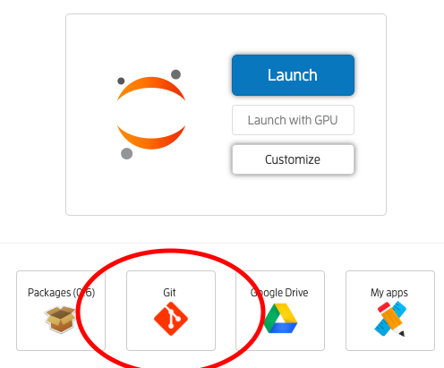

# M4
## Metals, Magnets, and Miscellaneous Materials: Blog Introduction to Computational Condensed Matter

### by Christina Lee,

### Check out http://albi3ro.github.io/M4/ to get the static website version of these jupyter notebooks.

[](http://jose.theoj.org/papers/f84b319959fff4dcab2da564579512cc)

I vary the level from undergraduate physics major to graduate student in the field.  I still encourage the curious layperson to peruse.  So you know what you are getting yourself into, I've developed a difficulty ranking scheme:

* <b>General:</b> Those with some background in programming, math, and physics should be able to follow.
* <b>Prerequisites:</b> I will spell out classes in the beginning that one should have taken
    in order to understand the physics of the post.  For example, in order to understand calculating
    the orbitals of a hydrogen-like atom, I will assume you analytically solved it in a Quantum Mechanics course.
    Even if you haven't taken  the classes, feel free to still try.
* <b>Graduate:</b> Specialty technique that assumes you have a solid grounding in the basics.  I still try to not take any knowledge for granted, but not everyone will be trying to learn these things in the first place.
* <b>Numerics:</b>Without a specific physics goal.  Sometimes I may just want to talk about something programming or numerical method related.
* <b>Programming:</b> Something related to the language itself.

## Julia

The blog will be written in the form of Julia (http://julialang.org/) Jupyter notebooks. This language has a syntax similar to MATLAB or Python, and is easily human readable.  I encourage active participation by playing with the code.

You can either install Julia and Jupyter notebook on your own machine (https://julialang.org/downloads/), or use JuliaBox (https://www.juliabox.com/) to view and interact with the files. I've recently updated the notebooks to version v1.0.1, though any of the v1.0.x should work.

To use JuliaBox (the easiest option), log in with a Google account, and then click on the sync (Git) tab.  



Under the Github directory, input the clone https://github.com/albi3ro/M4.git , use branch master, and name the folder as you see fit.

Check out http://julialang.org/ for documentation on this new and exciting language, and learn how to install it on your own machine.

### Packages

Many times I will use extra packages developed for Julia, such as for plotting functionality. The file Project.toml file specifies all explicitly required packages used, and Manifest.toml lists dependencies as well.  To install all the required packages for use in this folder:

* ``cd`` to the project directory
* Enter a Julia REPL
* Enter Package Mode by pressing `]`
* Type the following instructions

```julia
(v1.0) pkg> activate .
(M4)   pkg> instantiate 

```
* Exit Package mode with backspace

If you don't want to use an REPL Package `]` mode, you can also add packages individually  with the commands

```julia
    using Pkg
    Pkg.add("pkgname")
```

See more at the [Pkg documentation](https://julialang.github.io/Pkg.jl/v1/environments/#Using-someone-else's-project-1).

If you are using JuliaBox, you will need to evaluate the those lines each time.

[Plots.jl](https://github.com/JuliaPlots/Plots.jl), the plotting utility I prefer, calls to other plotting packges, which also need to be installed.  I prefer [GR.jl](https://github.com/jheinen/GR.jl) or [PlotlyJS.jl](https://github.com/sglyon/PlotlyJS.jl), though PlotlyJS doesn't seem to be working anymore.

### Using my packages
I have written packages of my own for use in certain sections.  To add these to the path, download them to the folder you are using, and in your command line, type `push!(LOAD_PATH,"/path/to/my/code")`, where `/path/to/my/code` is the location of the package.  Then, you can type `using Lattices` in just the same way.  

### Contributing

If you have expierence in a topic you would wish to see covered, please email me (chrissie.c.l@gmail.com).  I have multiple topics I would love to cover, but just don't have the expertise or time to learn everything myself from scratch.

If you spot any grammar issues, feel free to either give a pull request or start an issue.  

For technical mistakes, please submit a pull request.  

The website [albi3ro.github.io/M4](albi3ro.github.io/M4) has Discuss commenting functionality attached to each page where you can comment.  

You can also contact me (chrissie.c.l@gmail.com) with feedback or questions.

## For further reference
Interested in learning more?

* Principles of Condensed Matter Physics - Chaikin & Lubensky
* Condensed Matter in a Nutshell - Mahan
* Inna Vishik on Quora https://www.quora.com/profile/Inna-Vishik
* https://thiscondensedlife.wordpress.com/

Know any good ones? Let me know!
